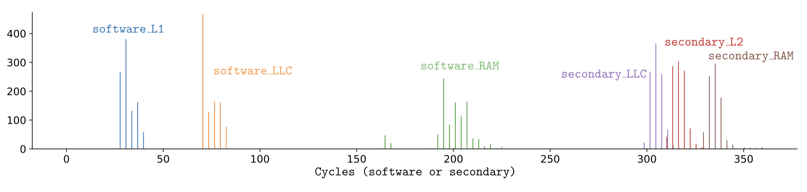

# Cache Timing Histogram

<p align="center" width="100%">
     
</p>

This code measures the CPU's and the secondary device's access times for lines served from various caches (e.g. L1, LLC) and from RAM. It then plots the histogram above (copied from the Appendix A of the paper).

The corresponding experiment is implemented in `sw/basic/attacker_histogram.c`. It creates log files with the access time measurements, which are then turned into a plot by `sw/basic/scripts/histogram.py`.

## Initialization

* [Program the FPGA](./program_fpga.md)
* [Handle CPU Assignments](./cpu_assignments.md)

## Execution

```
$ make histogram
$ ./app_histogram
$ python3 ./scripts/histogram.py
```

## Expected Results

The execution will create a file `histogram.png` in the `./log` folder. 

An expected histogram is given above, which is same as the one presented in the Appendix A of the paper.