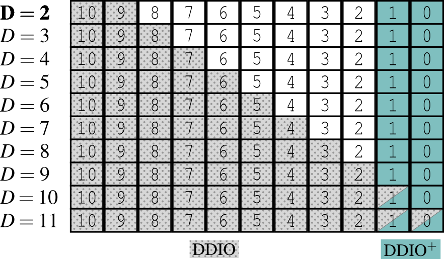

# Reverse Engineering the DDIO and DDIO+ regions

<p align="center" width="100%">
     
</p>

This code is used to reproduce the findings in Section 5: _Structure of the LLC set_. It has been tested on an Intel Xeon Silver 4208 (our local setup).

## Initialization

* [Program the FPGA](./program_fpga.md)
* [Install the MSR Tools](./install_msr_tools.md)
* [Install the CAT Tools](./install_cat_tools.md)
* [Handle CPU Assignments](./cpu_assignments.md)

## Execution

How to run (the second command needs `sudo`):

```
make
make run
```
___

## Determine the associativities of the DDIO and DDIO+ regions

### Configuration
- Set `#define ASSOCIATIVITY_TEST 1`

### Methodology
1. Place N lines in the DDIO/DDIO+ states, using the access sequences as described in Table 5 in the paper.
2. Read N lines again. If some are slow, this means that N exceeds the associativity of the region under consideration.

### Results
- DDIO region has associativity $D$ (as expected)
- DDIO+ region has associativity 2 (independently of $D$)
___

## Confirm the location of the DDIO region

### Configuration
- Set `#define EXPERIMENT_DDIO 1`

### Methodology
1. Place N lines in DDIO region with `hw_write`
    - Where $N=D$, since we know the DDIO associativity is D
2. Generate contention in specific LLC ways from CPU
    - Contention is limited to specific ways using the moving CAT masks from Farshin et al.
    - Properties of the masks:
        - Need to be contiguous
        - Need to be of size $\geq 2$
    - Again, since we know the DDIO associativity, we will use masks of size $D$
3. Read the N lines again and measure their access time with `hw_read`
    - If access times to lines are consistently slow, this means they have been evicted by the CPU contention
    - Thus, they must have been allocated to a way that belongs to BOTH:
        - the DDIO region (by definition)
        - the CAT mask (by observation: evicted)
    - The number of lines that are consistently evicted determines the number of ways that overlap between the DDIO region and the CAT mask

### Results ($D=2$)
- **Observations:**
    - CAT mask `0x600` has 2/2 contention
    - CAT mask `0x300` has 1/2 contention (mostly `es[1]`)
    - CAT masks with bit 10 and 9 equal to zero have 0/2 contention
- **Inferences**:
    - The DDIO ways correspond to mask `0x600` (two leftmost ways)
    - When empty (magnet), the DDIO ways are filled from MSB to LSB
        - This clarifies why, for single-way overlap (mask `0x300`),  `es[0]` is mostly in cache, and `es[1]` is always evicted
        - Indeed, when `es[0]` and `es[1]` are swapped, `es[0]` is always evicted
- **Remarks**:
    - Single-way CAT cannot be set (e.g., mask `0x400`)

### Results ($D$ generic)
- **Observations:**
    - The same pattern appears for generic $D$
- **Inferences:**
    - DDIO region grows to the right, as expected
___

## Confirm the presence of the DDIO+ region

### Configuration
- Set `#define EXPERIMENT_DDIO 0`

### Methodology
The methodology is similar to the DDIO experiment.
It differs mainly in the first step (to prepare the lines to the DDIO+ region instead of DDIO).
1. ~~Place lines in DDIO region with hw_write~~
Place lines in DDIO+ region with `hw_write; sw_write; hw_write`.

Also, since we know the DDIO+ associativity is 2: 
- we use $N=2$ addresses in step 1
- we use CAT masks of size 2

### Results ($D=2$)
- **Observations:**
    - There is contention for CAT in ways 0-1
- **Inferences:**
    - DDIO+ region has associativity 2 by default
    - DDIO+ region has mask `0x003`

### Results ($D$ generic)
- **Observations:**
    - There is contention for CAT in ways 0-1 (for $D<6$)
    - all `es[i]` for `i <= D-2` are evicted for ALL CAT masks
- **Inferences:**
    - DDIO+ region has associativity 2 (which is _fixed_ and does not grow with $D$)