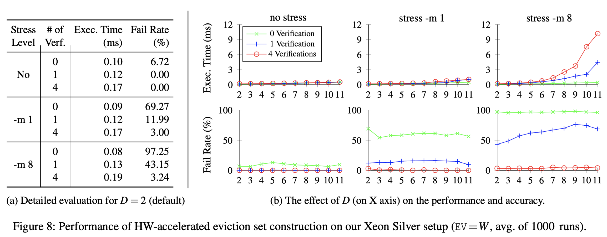

# Eviction Set Construction

<p align="center" width="100%">
     
</p>

This code is used to evaluate the eviction set construction performance for 
various configurations, which are:

* Non-default DDIO way settings
* Huge or small pages
* Different levels of stress
* Options of congruence checks integrated into the eviction set construction

This analysis is used in the paper for the evaluations in Section 8.1.1, and to 
construct Figure 8 (given above).

The corresponding experiment is implemented in `sw/evset_construction/main.c`. 

## Initialization

* [Program the FPGA](./program_fpga.md)
* [Install the MSR Tools](./install_msr_tools.md)
* [Handle CPU Assignments](./cpu_assignments.md)

For the CPU assignments of this specific example, you should consider the stress application. For this purpose, you can change line 18-19 in `main.c` :

```
#define ATTACKER_CORE 0
#define STRESS_COMMAND "taskset --cpu-list 2,4,6,8,10,12,14,18,20,22,24,26,28,30 stress -m %c & sleep 2"
```

Considering the attacker-victim models, we assume that the attacker controls her own CPUs, while the victim's CPUs are not under her control. Hence, we prefer to not associate the stress app with the CPUs of the corresponding attacker's app, while associating it with all the other CPUs.

## Execution

```
make
./app <stress_level> <page_type> <congruence_check_type> <DDIO_way_count>
```

The corresponding arguments are as follows:

### <stress_level>

For the stress, the app will invoke the `stress` application with passing the `<stress_level>` argument to it, as `stress -m <stress_level>`, if the argument is non-zero.

Be careful with too big numbers as it can freeze your computer. It is advised to consider the target platform's CPU count when selecting this value.

### <page_type>

`H` for huge pages, `S` for small.

### <congruence_check_type>

`N` for no checks, `S` for single check, `M` for multiple checks.

### <DDIO_way_count>

`2` is the minimum and default configuration. The maximum is determined by the associativity of your LLC cache. For example, 11 is the maximum in an 11-way set associative cache.

## Expected Results

For each execution, the app constructs an eviction set and prints how long it took to do so. In addition, it applies a congruence test to report how many addresses were erroneously determined to be congruent.

```
 EA | HW ADDR     SW ADDR           |Err|Loop |Cycle|
----|-------------------------------|---|-----|-----|
  0 | 0x3f009800 0x00007f76c0260000 | 0 |   0 | 325 |
  1 | 0x3f00d000 0x00007f76c0340000 | 0 |   0 | 327 |
  2 | 0x3f013000 0x00007f76c04c0000 | 0 |   0 | 333 |
  3 | 0x3f017800 0x00007f76c05e0000 | 0 |   0 | 327 |
  4 | 0x3f01a800 0x00007f76c06a0000 | 0 |   0 | 326 |
  5 | 0x3f01e000 0x00007f76c0780000 | 0 |   0 | 327 |
  6 | 0x3f022000 0x00007f76c0880000 | 0 |   0 | 332 |
  7 | 0x3f026800 0x00007f76c09a0000 | 0 |   0 | 322 |
  8 | 0x3f02b800 0x00007f76c0ae0000 | 0 |   0 | 323 |
  9 | 0x3f02f000 0x00007f76c0bc0000 | 0 |   0 | 323 |
 10 | 0x3f031000 0x00007f76c0c40000 | 0 |   0 | 322 |

Stress <stress_level> Page <page_type> Checks <congruence_check_type> D <DDIO_way_count>  

Time 0.17 ms. Error Count: 0
```

The collected results are evaluated in the Section 8.1.1 of paper, and summarised in Figure 8.
