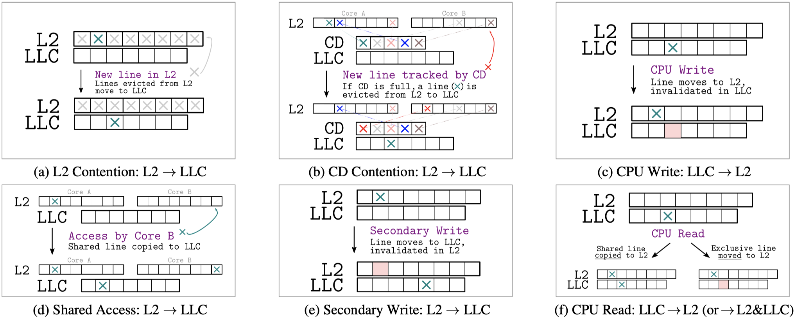

# Shared Access & CPU Read

<p align="center" width="100%">
     
</p>

This experiment provides supporting evidence for Fig 4d and 4f. It is implemented in `sw/figure4/shared_access_cpu_read.c`.  

## Initialization

* [Program the FPGA](./program_fpga.md)
* [Handle CPU Assignments](./cpu_assignments.md)

## Execution

Depending on which experiment you want to run, set the experiment macro to either `SHARED` or `UNSHARED`. Then, build and run it as follows:

```
$ make shared_cpu_rd
```

## Expected Results for unshared lines

### Do unshared lines have a copy in the LLC?

For unshared lines, the experiment gives the following results on our platform:

```
Where is the unshared line (based on access time)?
 [+] HW access time says        318 (L2)
 [+] SW access time says         38 (L2)
 [+] Other core time says       168 (Remote L2)
```

We conclude that unshared lines have:
- **a copy in the local L2 cache** (as the access time from SW corresponds to L2)
- **no copy in the LLC** (as otherwise both the HW access time and other core access time would correspond to those of LLC lines)

### LLC -> L2 for unshared lines?

```
 What happens to unshared lines in the LLC?
 [+] Same core time says         38 (L2)
 [+] Other core time says       146 (Remote L2)
```

For unshared lines in the LLC, we conclude what happens when they are read from SW. There is:
- **a copy in the local L2 cache** (as the access time from SW corresponds to L2)
- **no copy in the LLC** (as the other core access time corresponds to remote L2)

_These findings support (Fig. 4f)._

## Expected Results for shared lines

### Do shared lines have a copy in the LLC? (Fig. 4d)

For shared lines, the experiment gives the following results on our platform:

```
 Where is the shared line (based on access time)?
 [+] HW access time says        302 (LLC)
 [+] SW access time says         38 (L2)
 [+] Other core time says        84 (LLC)
```

We conclude that shared lines have:
- **a copy in the local L2 cache** (as the access time from SW corresponds to L2)
- **a copy in the LLC** (as both the HW access time and other core access time correspond to LLC times)

_These findings lead to the shared access method (Fig. 4d)._

### LLC -> L2 for shared lines?

```
 What happens to shared lines in the LLC?
 [+] Same core time says         38 (L2)
 [+] Other core time says        80 (LLC)
```

For shared lines in the LLC, we conclude what happens when they are read from SW. There is:
- **a copy in the local L2 cache** (as the access time from SW corresponds to L2)
- **a copy in the LLC** (as the other core access time corresponds to LLC)

_These findings support (Fig. 4f)._